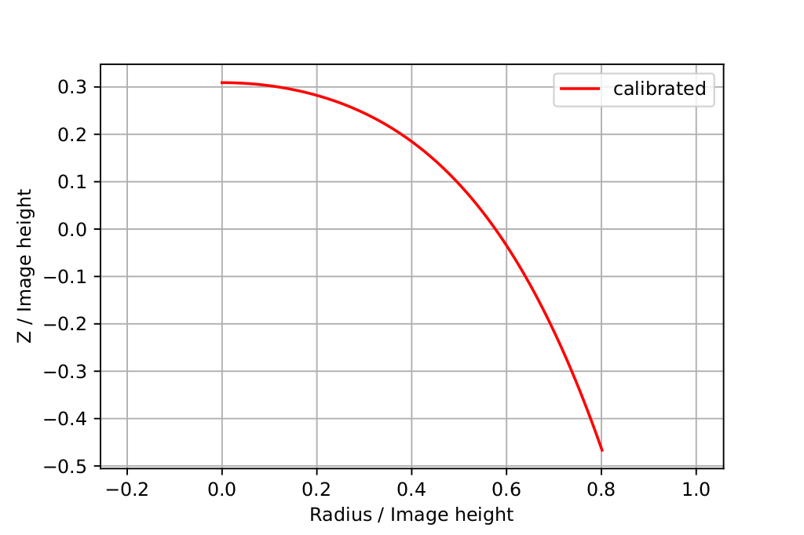

# Omnidirectional Camera Calibration
## Key features
 * pure python
 * initial solution based on [A Toolbox for Easily Calibrating Omnidirectional Cameras (Davide Scaramuzza, Agostino Martinelli, Roland Siegwart)](http://rpg.ifi.uzh.ch/docs/IROS06_scaramuzza.pdf)
 * Optimized solution via [Levenberg–Marquardt algorithm](https://en.wikipedia.org/wiki/Levenberg%E2%80%93Marquardt_algorithm) on reprojection error
 * Lie algebra based extrinsics optimization
 

([undistort example](doc/undistort.ipynb))
## Usage
1. Corner detection (see `python -m omnicalib.detect --help` for detailed argument description)
```
python -m omnicalib.detect --chessboard <rows> <columns> <square-size> --max-dim <max-dim> --threads <threads> <image-folder>
```
The file `detections.pickle` is written, which contains a **pickled dictionary** with the following format

```
{
    'detections': {
        <image_path_0>: {'image_points': <image_points>, 'object_points': <object_points>},
        ...
}
```
 * Image paths (`pathlib.Path`) are absolute
 * `image_points` are `torch.Tensor` with shape `N x 2` and dtype `torch.float64`
 * `object_points` are `torch.Tensor` with shape `N x 3` and dtype `torch.float64` and third colum, the z coordinate, all zeros

 If an external corner detection method is used, this file can simply be written manually.

 2. Calibration (see `python -m omnicalib --help` for detailed argument description)
 ```
python -m omnicalib --degree <degree> detections.pickle
```
## Result
A `calibration.yml` file (see [example_calibration.yml](doc/example_calibration.yml)) containing
 * `extrinsics` as list of `3 x 4` matrices
 * `poly_incident_angle_to_radius`, a polynom that converts incident angle to image radius
 * `poly_radius_to_z`, a polynom that converts radius to z component of view vector
 * `principal_point` in pixel

## Installation
Install the [latest wheel](https://github.com/tasptz/py-omnicalib/releases/latest) with
```
pip install https://github.com/tasptz/py-omnicalib/releases/download/<wheel_url>
```

## Method
For a detailed description see [method.md](doc/method.md).

## Simulation
Play with the calibration on simulated data with the provided [jupyter lab notebook](doc/simulation.ipynb). It generates randomized data for the following ideal projection models
 * equidistant
 * stereographic
 * orthographic
 * equisolid

 , see [Large Area 3D Human Pose Detection Via Stereo Reconstruction in Panoramic Cameras](https://arxiv.org/pdf/1907.00534.pdf) for a detailed description.

## Example
[Jupyter lab notebook](doc/example.ipynb), [example results](doc/example_calibration.yml)





